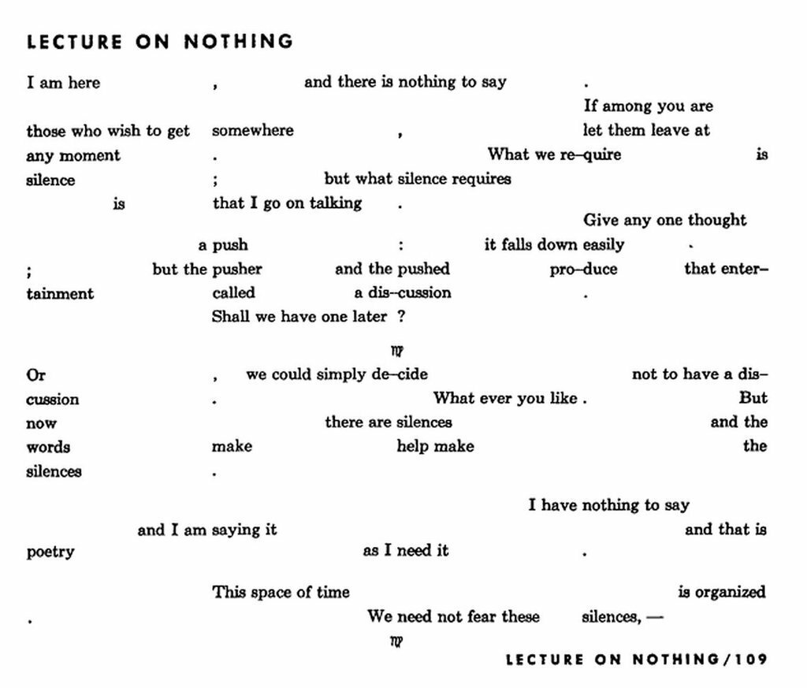

# Real-Time Collaborative Editor

# Following Activities

- Current State of Feeds
- Digest Email
- Keyword Pages
- Update on "significant" changes to expositions

# Representing On-Site Activities

- Agenda of AR Activities (events, lectures, exhibitions, performances, etc)
- Integration with SARA

# Public Space

